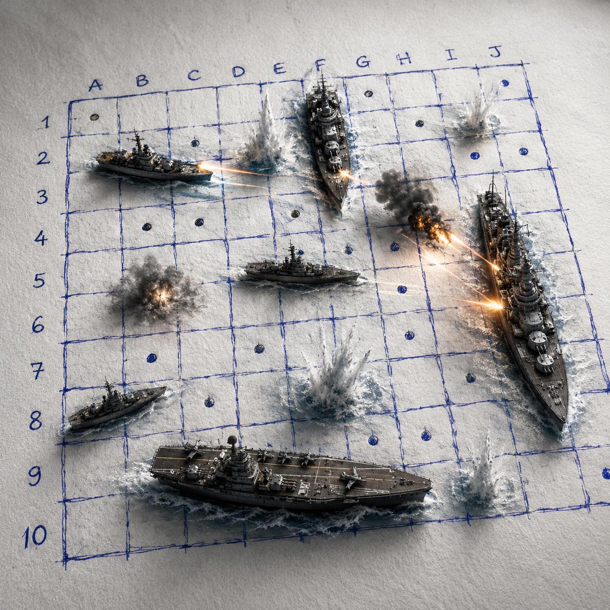

# Залп

[English](README.md) | Русский | [中文](README.zh-CN.md)

«Залп» — браузерный «Морской бой» для GitHub Pages: три локализации, PvP на одном устройстве, online PvP и игра против агента.

Публичная версия: https://agent-axiom.github.io/agents-salvo/



## Возможности

- Static frontend без фреймворка: `src/index.html`, `src/app.js`, `src/styles.css`.
- Чистое ядро правил: `src/core/game.js`.
- Стиль бумажного поля с синей шариковой ручкой, ближе к классическим тетрадным партиям.
- Классический русский флот: 1x4, 2x3, 3x2, 4x1.
- Корабли не соприкасаются сторонами и углами.
- Потопленные корабли обводятся, клетки вокруг отмечаются водой.
- PvP на одном устройстве, online PvP и режим против агента.
- Локализации: English, Русский, 中文.
- Светлая и тёмная темы.
- Синтетические звуковые эффекты и музыка главной через Web Audio; MP3 пока не нужны.
- Cloudflare Worker backend с Durable Objects для online-комнат.
- GitHub Pages workflow: `.github/workflows/pages.yml`.

## Локальная разработка

```bash
npm test
npm run build
npm start
```

После `npm start` открыть `http://localhost:5173`.

## GitHub Pages

1. Запушить репозиторий в GitHub.
2. В Settings -> Pages выбрать GitHub Actions.
3. Запустить workflow `Deploy GitHub Pages` или сделать push в `main`.

Workflow прогоняет `npm test`, собирает `dist` и публикует его как Pages artifact.

## Online backend

Backend нужен только для режима «Онлайн-комната».

```bash
npx wrangler deploy
```

Текущий Worker URL прописан во frontend:

```text
https://agents-salvo-room.if-ab6.workers.dev
```

Пользователи этот URL не видят. При смене backend обновить `window.SALVO_CONFIG.workerUrl` в `src/index.html` и заново задеплоить Pages.

## Звук

Сейчас используются синтетические Web Audio пресеты из `src/core/audio.js` и `src/audio.js`.

Будущие MP3 можно подготовить с такими именами:

```text
public/audio/menu-loop.mp3
public/audio/shot.mp3
public/audio/miss.mp3
public/audio/hit.mp3
public/audio/sunk.mp3
public/audio/victory.mp3
public/audio/defeat.mp3
public/audio/ui-click.mp3
public/audio/turn.mp3
public/audio/room-ready.mp3
```

## Историческая справка

Текст на главной основан на статье «Морской бой (игра)»: https://ru.wikipedia.org/wiki/Морской_бой_(игра)
